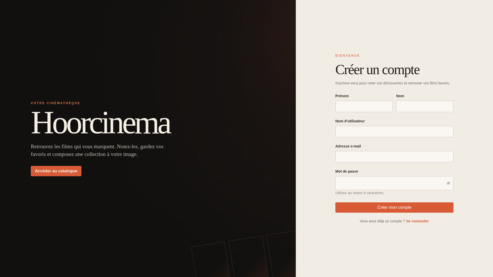
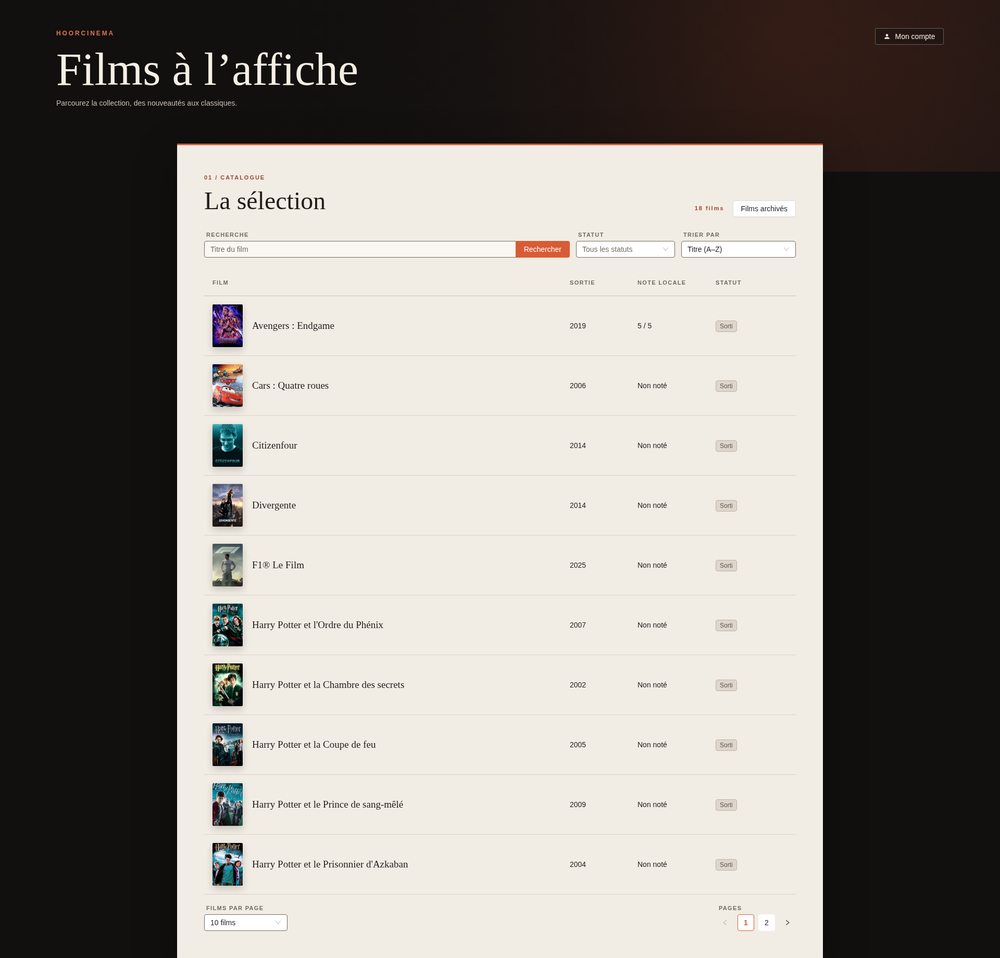
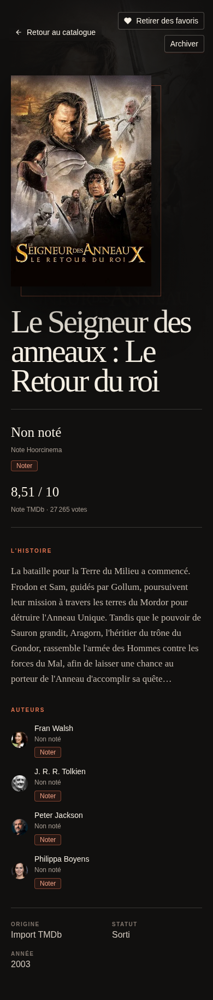
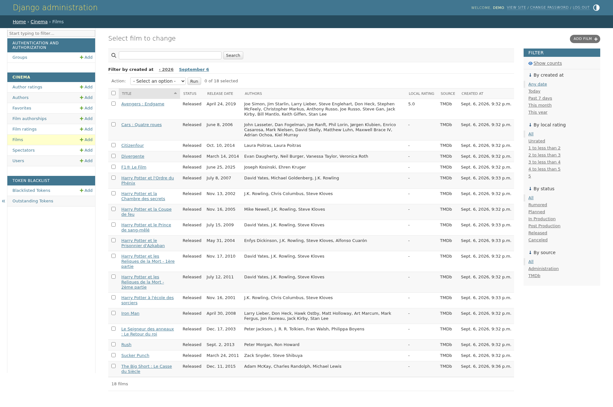

# Hoorcinema

Hoorcinema is a Django REST Framework and React application for browsing films,
rating films and authors, managing favorites, and importing catalogue data from
[The Movie Database (TMDb)](https://www.themoviedb.org/). It uses PostgreSQL,
JWT authentication, Ant Design, TanStack React Query, and Zustand.

The Docker setup is intended for development and assessment only. It runs the
Django and Vite development servers, enables Django debug mode by default, and
provides development-only database and secret-key defaults. Do not deploy it as
a production configuration.

## Screenshots

### Anonymous home



### Film catalogue



### Film details


### Mobile views

| Anonymous home | Film catalogue | Film details |
| --- | --- | --- |
|  |  |  |

### Administration

| Django film administration |
| --- |
|  |

## Requirements

The recommended workflow requires Docker with the Compose plugin and network
access for the initial image and dependency downloads.

The container stack currently uses PostgreSQL 18, Python 3.13, Node.js 24, and
`uv` 0.12.10. For optional host-side development, install Python 3.13+, `uv`,
Node.js 24, npm, and a reachable PostgreSQL server. Django has no SQLite
fallback, and the Compose PostgreSQL port is not published to the host.

## Environment

Compose reads the repository-root `.env` file automatically. Start from the
documented template:

```bash
cp .env.example .env
```

| Variable | Development default | Purpose |
| --- | --- | --- |
| `POSTGRES_DB` | `cinema` | PostgreSQL database name. |
| `POSTGRES_USER` | `cinema` | PostgreSQL user. |
| `POSTGRES_PASSWORD` | `development-only-password` | PostgreSQL password. Replace it outside disposable development. |
| `DJANGO_SECRET_KEY` | `development-only-secret-key-change-before-production` | Django signing key. Always replace it outside disposable development. |
| `DJANGO_DEBUG` | `true` | Enables debug mode only when its value is `true`, case-insensitively. |
| `DJANGO_ALLOWED_HOSTS` | `localhost,127.0.0.1,backend` | Comma-separated Django host allowlist. |
| `DEMO_AUTHOR_PASSWORD` | Empty | Password used by `seed_demo_data` for `demo_author`. |
| `DEMO_SPECTATOR_PASSWORD` | Empty | Password used by `seed_demo_data` for `demo_spectator`. |
| `DEMO_ADMIN_PASSWORD` | Empty | Password used by `seed_demo_data` for the `demo_admin` superuser. |
| `TMDB_API_TOKEN` | Empty | TMDb API read-access token used only by `import_tmdb`. |

Passwords and tokens must remain in `.env` or another secret store and must not
be committed. The repository ignores `.env`. PostgreSQL initialization values
apply only when its data volume is first created; after changing them, either
update the existing database credentials manually or recreate the development
volume.

When running tools directly on the host, the root `.env` is not loaded by Django
or Vite automatically. Export the backend variables in the shell. Host-run
Django additionally needs `POSTGRES_HOST` and optionally `POSTGRES_PORT`; Vite
accepts `VITE_API_PROXY_TARGET` and defaults to `http://localhost:8000`.

## Start With Docker

Build and start PostgreSQL, Django, and Vite:

```bash
docker compose up --build
```

The backend waits for PostgreSQL, applies migrations, and then starts Django.
Startup does not create catalogue records or user accounts. The services are
available at:

- Web application: <http://localhost:5173>
- Public film catalogue: <http://localhost:5173/films/>
- Archived film catalogue: <http://localhost:5173/films/archives/>
- Health API: <http://localhost:8000/api/health/>
- Django administration: <http://localhost:8000/admin/>

The frontend proxies `/api` requests to Django. Ports `5173` and `8000` must be
available on the host.

Run in the background and inspect logs with:

```bash
docker compose up --build --detach
docker compose logs --follow
```

Stop the application while preserving PostgreSQL data:

```bash
docker compose down
```

To perform a completely clean start, delete the Compose-managed volume before
starting again:

```bash
docker compose down --volumes --remove-orphans
docker compose up --build
```

`docker compose down --volumes` permanently deletes all development database
content, including users, films, ratings, favorites, sessions, and blacklisted
JWTs. Migrations run again at startup, but accounts and catalogue data must be
created again.

The frontend source is bind-mounted for Vite hot reload. Backend source and
dependency changes require rebuilding the backend image.

## Create Data And Accounts

Create an administrator interactively:

```bash
docker compose exec backend uv run python manage.py createsuperuser
```

Alternatively, configure all three `DEMO_*_PASSWORD` variables and create the
deterministic 18-film demonstration catalogue and accounts:

```bash
docker compose exec backend uv run python manage.py seed_demo_data
```

The command creates or updates `demo_author`, `demo_spectator`, and the
`demo_admin` superuser. It is idempotent, validates all passwords before writing,
and restores its expected films, authorship links, sample ratings, and favorite.
It also resets the three account passwords and reconciles all TMDb-sourced data
to its static catalogue: TMDb films outside that catalogue and orphaned TMDb
authors are deleted. Do not use the command against a database containing TMDb
imports that must be preserved.

## Frontend Usage

The interface is in French and supports desktop and mobile layouts.

- `/` displays spectator registration by default and links to login and the
  public catalogue.
- `/login/` displays login.
- `/films/` lists active films and supports title search, TMDb status filtering,
  sorting, and pagination with 10, 50, or 100 films per page.
- `/films/archives/` provides the same controls for archived films.
- `/films/favorites/` provides authenticated spectators with the same controls
  for their personal favorite films.
- `/films/{id}/` displays a public film detail page.
- Authenticated spectators whose JWT advertises `can_rate` can rate films and
  authors and add or remove favorites from a film detail page.
- Staff users whose JWT advertises `can_change_film` can archive and unarchive
  films; Django still checks the permission for every request.
- Administrative film or author editing remains available through the API and
  Django administration rather than dedicated frontend screens.

JWTs are temporarily persisted in browser `localStorage` so development sessions
survive reloads. This is not the intended production security model; use secure
`HttpOnly` cookies and the corresponding CSRF protections before deployment.

## API Conventions

All routes use the `/api/` prefix, require their trailing slash, and return JSON.
Public film and author reads do not require authentication. Protected requests
use an access token:

```http
Authorization: Bearer <access-token>
Content-Type: application/json
```

Paginated endpoints accept `page` and `page_size`. The default page size is 10
and the maximum is 100. They return:

```json
{
  "count": 23,
  "next": "http://localhost:8000/api/films/?page=2",
  "previous": null,
  "results": []
}
```

Invalid filters return `400`, unknown resources return `404`, unauthenticated
protected requests return `401`, and authenticated requests lacking a required
role or permission return `403`.

## Authentication API

### Register

`POST /api/auth/register/` creates a non-staff spectator. It returns the created
profile with `201` but does not log the user in.

```bash
curl --request POST http://localhost:8000/api/auth/register/ \
  --header 'Content-Type: application/json' \
  --data '{
    "username": "viewer",
    "email": "viewer@example.com",
    "first_name": "Example",
    "last_name": "Viewer",
    "password": "replace-with-a-strong-password"
  }'
```

`username` and `password` are required. Usernames are unique and authenticated
case-insensitively. Passwords pass through Django's configured validators.

### Login

`POST /api/auth/login/` accepts `username` and `password` and returns an access
and refresh token with `200`:

```bash
curl --request POST http://localhost:8000/api/auth/login/ \
  --header 'Content-Type: application/json' \
  --data '{"username":"viewer","password":"replace-with-a-strong-password"}'
```

```json
{
  "refresh": "<refresh-token>",
  "access": "<access-token>"
}
```

Access tokens are valid for 5 minutes and refresh tokens for 1 day. Tokens use
HS256 with Django's secret key. Their standard claims include `token_type`,
`exp`, `iat`, `jti`, and `user_id`. Hoorcinema also adds `can_change_film` and
`can_rate` as UI capability hints. They respectively represent staff with
`cinema.change_film` and users in the spectator group; they never replace
server-side authorization.

### Refresh And Logout

`POST /api/auth/refresh/` accepts the current refresh token and returns a new
access and replacement refresh token:

```bash
curl --request POST http://localhost:8000/api/auth/refresh/ \
  --header 'Content-Type: application/json' \
  --data '{"refresh":"<current-refresh-token>"}'
```

Rotation blacklists the submitted refresh token and recalculates
`can_change_film` and `can_rate` from the current user. Store the replacement
refresh token; reusing the previous token returns `401`.

`POST /api/auth/logout/` blacklists the submitted refresh token and returns
`200`. It does not require an access token:

```bash
curl --request POST http://localhost:8000/api/auth/logout/ \
  --header 'Content-Type: application/json' \
  --data '{"refresh":"<current-refresh-token>"}'
```

Blacklisting a refresh token does not revoke access tokens already issued from
it. Those remain valid until their short expiry.

## Films API

### Read Films

`GET /api/films/` is public and paginated. It returns active films by default.

| Parameter | Values and behavior |
| --- | --- |
| `page` | Page number, starting at 1. |
| `page_size` | Results per page, default 10 and maximum 100. |
| `is_archived` | Case-insensitive `true` or `false`; defaults to `false`. |
| `status` | Exact TMDb status value. |
| `source` | `ADMIN` or `TMDB`. |
| `search` | Case-insensitive title terms. Multiple terms must all match. |
| `ordering` | Comma-separated `title`, `release_date`, or `local_rating`, optionally prefixed with `-`. |

Examples:

```text
GET /api/films/?status=Released&source=TMDB&search=night
GET /api/films/?is_archived=true&ordering=-release_date
GET /api/films/?ordering=-local_rating,title&page=2&page_size=50
```

The default ordering is `title,id`. Null ordering values are always placed last.
Film statuses use TMDb's exact values: `Rumored`, `Planned`, `In Production`,
`Post Production`, `Released`, and `Canceled`.

`GET /api/films/{id}/` is public and returns nested authors, local ratings on 5,
TMDb ratings on 10, source metadata, and timestamps. Archived films remain
directly readable. Decimal ratings are represented as two-decimal JSON strings
and missing ratings are `null`.

### Administer Films

`PATCH /api/films/{id}/` requires a staff user with `cinema.change_film`. It
accepts any subset of:

```json
{
  "title": "Example Film",
  "description": "Updated description",
  "release_date": "2026-09-07",
  "status": "Released",
  "authors": [12, 13],
  "source": "ADMIN",
  "tmdb_id": null,
  "tmdb_vote_average": "8.25",
  "tmdb_vote_count": 200,
  "poster_path": "/poster.jpg"
}
```

Author IDs must identify users with the author role. TMDb scores range from 0 to
10, vote counts cannot be negative, and `tmdb_id` is unique when present.
`is_archived` is intentionally not writable through this endpoint.

`PATCH /api/films/{id}/archive/` and
`PATCH /api/films/{id}/unarchive/` require the same permission and accept an
empty JSON object. Both return the film with `200`, are idempotent, and only
change `is_archived`; they never alter the TMDb status.

## Authors API

`GET /api/authors/` and `GET /api/authors/{id}/` are public. Only users with the
author role appear in these endpoints. Author responses include profile fields,
local rating, and nested films.

| Parameter | Values and behavior |
| --- | --- |
| `page` | Page number, starting at 1. |
| `page_size` | Results per page, default 10 and maximum 100. |
| `source` | `ADMIN` or `TMDB`. |
| `search` | Case-insensitive username, first-name, and last-name search. |
| `ordering` | Comma-separated `last_name`, `first_name`, `username`, or `local_rating`, optionally prefixed with `-`. |

The default ordering is `last_name,first_name,username`.

`PATCH /api/authors/{id}/` requires staff status and
`cinema.change_author`. It accepts any subset of `username`, `first_name`,
`last_name`, `email`, `date_of_birth`, `bio`, `avatar`, `source`, and `tmdb_id`.

`DELETE /api/authors/{id}/` requires staff status and
`cinema.delete_author`. It returns `204` for an author without films. An author
with films cannot be deleted and returns `409`:

```json
{
  "code": "author_has_films",
  "detail": "Authors with films cannot be deleted."
}
```

## Ratings And Favorites API

These endpoints require an authenticated user with the cumulative `SPECTATOR`
role. Staff status alone does not grant spectator actions.

| Method and path | Behavior |
| --- | --- |
| `PUT /api/films/{id}/rating/` | Create or replace the current spectator's film rating. |
| `PUT /api/authors/{id}/rating/` | Create or replace the current spectator's author rating. |
| `POST /api/films/{id}/favorite/` | Add a favorite idempotently. |
| `DELETE /api/films/{id}/favorite/` | Remove a favorite idempotently. |
| `GET /api/me/favorites/` | Return only the current spectator's paginated favorite films with catalogue search, status filter, and ordering. |

Ratings use an integer score from 1 to 5:

```bash
curl --request PUT http://localhost:8000/api/films/42/rating/ \
  --header 'Authorization: Bearer <access-token>' \
  --header 'Content-Type: application/json' \
  --data '{"score":5}'
```

A new rating returns `201`; replacing it returns `200`. Adding a new favorite
returns `201`, adding it again returns `200`, and removal returns `204` whether
or not the favorite already existed. Archived films can still be read, rated,
favorited, and returned by the current spectator's favorites endpoint.

## Permission Matrix

| Operation | Anonymous | Authenticated spectator | Staff with required permission |
| --- | --- | --- | --- |
| Read films and authors | Allowed | Allowed | Allowed |
| Register, login, refresh, logout | Allowed by endpoint credentials | Allowed by endpoint credentials | Allowed by endpoint credentials |
| Rate films and authors | `401` | Allowed | Allowed only with spectator role |
| Manage own favorites | `401` | Allowed | Allowed only with spectator role |
| Update or archive films | `401` | `403` | `cinema.change_film` required |
| Update authors | `401` | `403` | `cinema.change_author` required |
| Delete authors without films | `401` | `403` | `cinema.delete_author` required |

Administrative writes require both `is_staff` and the listed Django permission.
Superusers satisfy these checks. Roles are cumulative, so an account may be both
an author and a spectator.

## Import From TMDb

Set `TMDB_API_TOKEN` to a TMDb API read-access token, then import one page of
popular films:

```bash
docker compose exec backend uv run python manage.py import_tmdb --limit 20 --page 1
```

Import one film directly by its TMDb movie ID:

```bash
docker compose exec backend uv run python manage.py import_tmdb --movie-id <tmdb_id>
```

| Option | Default | Behavior |
| --- | --- | --- |
| `--limit N` | `20` | Maximum entries considered from the selected popular-films page. |
| `--page N` | `1` | Popular-films page to request. |
| `--movie-id ID` | Not set | Import one film without requesting the popular list; page and limit are ignored. |
| `--language CODE` | `fr-FR` | TMDb language for details and credits. |
| `--dry-run` | Disabled | Run the complete import and roll back database writes. |

Numeric options must be positive integers. Network requests use a 10-second
timeout. French is requested by default; missing French `title` or `overview`
values are filled individually from `en-US`. Passing `--language en-US` disables
that fallback request.

Films and people are updated idempotently by TMDb ID. Directors, screenplay
credits, writers, and members of the Writing department become authors with
unusable passwords. The import preserves local ratings, favorites, and archival
state, but replaces each imported film's author links with the current selected
credits. It keeps the exact valid TMDb status and stores TMDb ratings separately
from local ratings.

The importer refuses to overwrite local records that collide with a TMDb ID or
generated `tmdb_<person-id>` username. A popular-list failure aborts the command;
an individual film failure is reported and processing continues. The final
summary reports `created`, `updated`, `skipped`, and `failed` counts. A dry run
reports what would have changed even though its transactions are rolled back.

## Tests And Quality Checks

Run backend checks against PostgreSQL in disposable containers:

```bash
docker compose run --rm backend uv run ruff format --check .
docker compose run --rm backend uv run ruff check .
docker compose run --rm backend uv run pytest
docker compose run --rm backend uv run python manage.py makemigrations --check --dry-run
docker compose run --rm backend uv run python manage.py check
```

Run frontend checks:

```bash
docker compose run --rm frontend npm run format:check
docker compose run --rm frontend npm run lint
docker compose run --rm frontend npm run typecheck
docker compose run --rm frontend npm run test -- --run
docker compose run --rm frontend npm run build
```

Validate the Compose file itself with:

```bash
docker compose config --quiet
```

The equivalent commands can be run from `backend/` with `uv run ...` or from
`frontend/` with `npm run ...` after installing locked dependencies with
`uv sync --frozen` and `npm ci`. Backend commands still require a reachable
PostgreSQL database and all database environment variables.

## License

Hoorcinema is available under the [MIT License](LICENSE).
